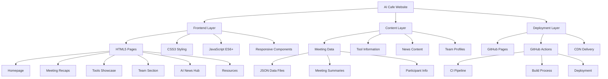
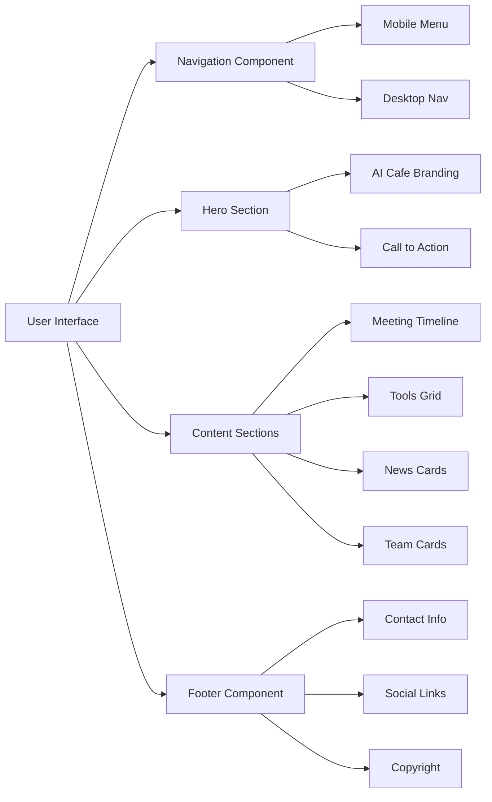
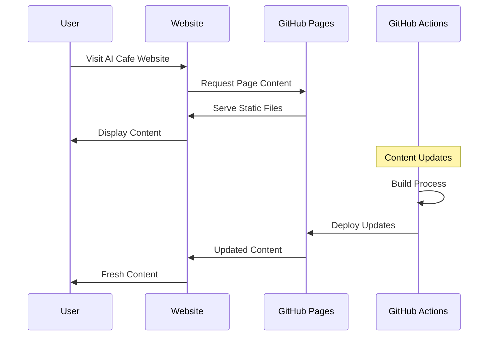

# AI Cafe Website - Architecture Overview

## System Architecture Diagram



## Component Architecture



## Data Flow Architecture



## Technology Stack

### Frontend Technologies
- **HTML5**: Semantic markup, accessibility features
- **CSS3**: Grid, Flexbox, Custom Properties, Animations
- **JavaScript ES6+**: Modern syntax, modules, async/await
- **Web Components**: Reusable UI elements

### Development Tools
- **GitHub Actions**: CI/CD pipeline
- **GitHub Pages**: Static site hosting
- **Lighthouse**: Performance monitoring
- **ESLint**: Code quality
- **Prettier**: Code formatting

### Design System
- **CSS Custom Properties**: Consistent theming
- **Component Library**: Reusable UI components
- **Responsive Design**: Mobile-first approach
- **Accessibility**: WCAG 2.1 compliance

## File Structure Details

```
ai-cafe-website/
├── .github/
│   ├── workflows/
│   │   ├── ci.yml              # Continuous Integration
│   │   └── deploy.yml          # Deployment Pipeline
│   ├── ISSUE_TEMPLATE/
│   │   ├── bug_report.md
│   │   ├── feature_request.md
│   │   └── meeting_recap.md
│   └── PULL_REQUEST_TEMPLATE.md
├── src/
│   ├── assets/
│   │   ├── css/
│   │   │   ├── main.css        # Main stylesheet
│   │   │   ├── components.css  # Component styles
│   │   │   └── responsive.css  # Media queries
│   │   ├── js/
│   │   │   ├── main.js         # Main JavaScript
│   │   │   ├── components.js   # UI components
│   │   │   └── data.js         # Data handling
│   │   ├── images/
│   │   │   ├── logo/
│   │   │   ├── tools/
│   │   │   └── team/
│   │   └── data/
│   │       ├── meetings.json   # Meeting data
│   │       ├── tools.json      # Tools information
│   │       └── team.json       # Team profiles
│   ├── pages/
│   │   ├── meetings/
│   │   ├── tools/
│   │   ├── news/
│   │   ├── team/
│   │   └── resources/
│   └── components/
│       ├── navigation.html
│       ├── hero.html
│       ├── footer.html
│       └── cards.html
├── docs/                       # Documentation
├── tests/                      # Test files
├── index.html                  # Homepage
├── README.md                   # Project documentation
├── LICENSE                     # Open source license
├── CONTRIBUTING.md             # Contribution guidelines
├── CODE_OF_CONDUCT.md          # Community guidelines
├── SECURITY.md                 # Security policy
└── package.json                # Project configuration
```

## Performance Optimization Strategy

### Loading Performance
- **Critical CSS**: Inline above-the-fold styles
- **Lazy Loading**: Images and non-critical content
- **Resource Hints**: Preload, prefetch, preconnect
- **Compression**: Gzip/Brotli for text assets

### Runtime Performance
- **Efficient JavaScript**: Minimal DOM manipulation
- **CSS Optimization**: Avoid layout thrashing
- **Image Optimization**: WebP format, responsive images
- **Caching Strategy**: Service worker implementation

## Security Considerations

### Content Security Policy
```
Content-Security-Policy: 
  default-src 'self';
  script-src 'self' 'unsafe-inline';
  style-src 'self' 'unsafe-inline';
  img-src 'self' data: https:;
  font-src 'self';
```

### Additional Security Measures
- HTTPS enforcement
- Input sanitization
- Dependency vulnerability scanning
- Regular security audits

## Accessibility Features

### WCAG 2.1 AA Compliance
- Semantic HTML structure
- Proper heading hierarchy
- Alt text for images
- Keyboard navigation support
- Color contrast compliance
- Screen reader compatibility

### Progressive Enhancement
- Core functionality without JavaScript
- Graceful degradation
- Mobile-first responsive design
- Fast loading on slow connections

---

This architecture provides a solid foundation for building a modern, performant, and accessible AI Cafe website that follows GitHub's best practices and specifications.